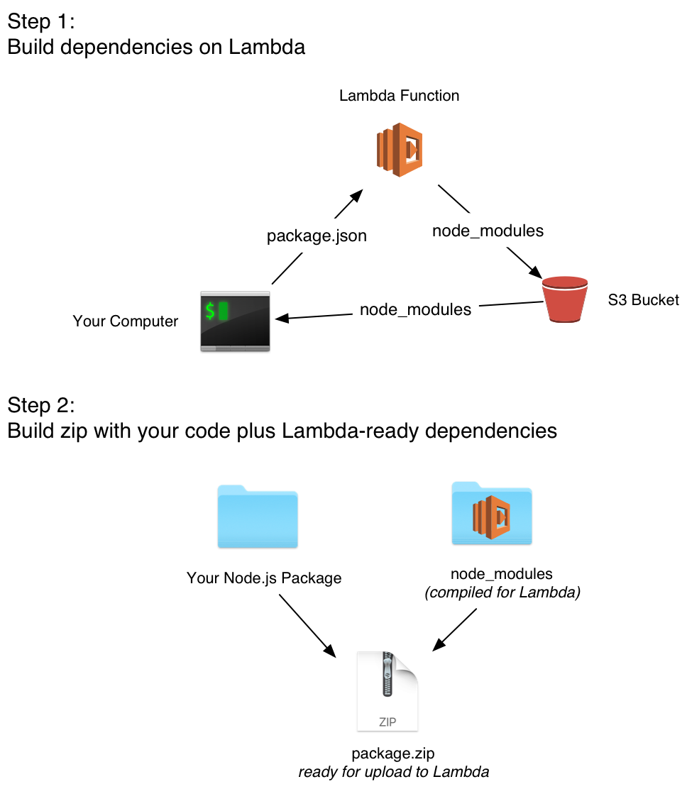

## Lambda Packager

Lambda Packager builds your project's npm packages for use on AWS
Lambda using AWS Lambda.

### Motivation

AWS Lambda runs Node.js apps, but you have to provide the `node_modules`
directory yourself. Building it on your local machine won't work if your
dependencies contain native code that needs to be compiled. Amazon
suggests running an EC2 instance, compiling the dependencies there
manually, then copying them back to your machine over SSH.

Lambda Packager makes deploying Node.js code to AWS Lambda easy, by
using Lambda itself to compile your dependencies.

Just provide Lambda Packager with a directory containing your Lambda
function (it must contains a `package.json` file with a list of
dependencies), and it will build a zip file of that directory with a
Lambda-compatible `node_modules` directory that's ready to deploy.

### Usage

**Note**: You must deploy the Lambda builder before these commands will
work. See [Deployment](#deployment).

#### Command Line

```sh
lambda-packager package my-package output.zip
```

#### Programmatic

```js
var lambdaPackager = require('lambda-packager');

lambdaPackager.build({
  from: 'my-package',
  to: 'output.zip'
});
```

Assuming `my-package` is a path to a directory with a `package.json`
file, its dependencies will be compiled via Lambda, then the package
plus the dependencies will be placed into `my-package-function.zip`.

## Deployment

To build dependencies, Lambda Packager uploads your `package.json` to a
Lambda function that builds your dependencies in the AWS environment.

To deploy this builder function to AWS, run the `lambda-packager deploy`
command, which will prompt you for the name to use for the
CloudFormation stack, as well as what region to create it in.  It will
automatically use the same credentials as the AWS CLI.

This command builds a CloudFormation stack that provisions
everything needed to build dependencies for Lambda Packager:

* IAM Role
* Lambda Function
* S3 Bucket

Make sure that the AWS account you have authorized via the AWS CLI has
permission to create each of these resources.

### Example

Imagine I have a Node.js Lambda function that I want to deploy. It's
file structure looks like this:

```
simple-package
├── index.js
└── package.json
```

Your `package.json` contains a list of dependencies, like this:

```js
{
  "dependencies": {
    "contextify": "0.1.14"
  }
}
```

`contextify` contains native code, so if I run `npm install` on my
computer and upload my project to Lambda, it won't work. Instead, I'll
use `lambda-packager` to build it:

```sh
lambda-packager package simple-package simple-package-lambda.zip
```

After a few seconds to a few minutes (depending on the number of
dependencies), the `package` command will produce the
`simple-package-lambda.zip` file in my current directory. That zip file,
if expanded, would look like this:

```
simple-package
├── index.js
└── package.json
└── node_modules
    └── contextify
```

Because the zip file is just your package with a Lambda-compatible
`node_modules` directory, it's ready to upload to your Lambda function,
either via the AWS CLI, the AWS console, or via another tool.

## How It Works



npm packages written in pure JavaScript run fine on Lambda, but many
packages contain native code (written in C or C++) that must be
compiled. If you build those dependencies on your local machine, they're
unlikely to work on the custom version of Amazon Linux that powers AWS
Lambda.

Lambda Packager works by invoking a Lambda function running on AWS and
uploading your project's `package.json` to it. It copies that
`package.json` to a temporary directory, then runs `npm install` to
compile the dependencies in the Lambda environments

Once compilation is complete, it uploads the Lambda-compatible
dependencies to S3. Those dependencies are then downloaded back to your
local machine.

To facilitate deployment, Lambda Packager will create a copy of your
Node package, copy in the Lambda-built `node_modules` directory, and
create a zip file that is ready to deploy via the AWS console or CLI
utility.

## Thanks

Lambda Packager was inspired by the [Thaumaturgy][thaumaturgy] project.
I wanted to make something more automated that used my projects'
`package.json`, rather than specifying dependencies manually. I also
wanted something that bundled everything into a ready-to-deploy zip.

Work on this project is generously sponsored by [Bustle Labs][bustle-labs].

[thaumaturgy]: https://github.com/node-hocus-pocus/thaumaturgy
[bustle-labs]: http://www.bustle.com/labs
